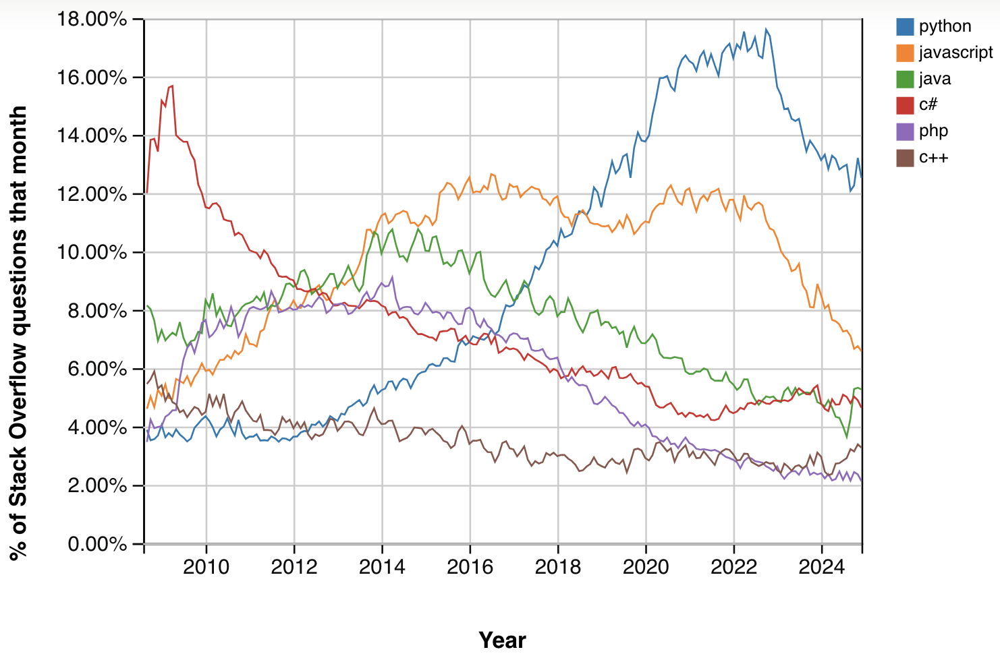

# Objectives
- What is the Python Programming Language
- Why use Python for Data Science
- What are Jupyter Notebooks

## What is the Python Programming Language
Python was designed by Guido van Rossum and first became available for use in 1991. Python's syntax is not complicated when compared to many other languages. This will allow you to focus on learning programming and machine learning/data science concepts rather than a complicated language. 

One important thing to remember is that Python's simplicity relies upon proper indentation, which you'll find helps you to write more clean and readable code. If you've dabbled with HTML or other languages where coding style is emphasized, you know the importance of indentation already, but you'll soon learn why Python requires it.

## Why use Python for Finance
The simplest reason is that Python is very popular programming language. The image below shows the percentage of [Stack Overflow questions over time](https://trends.stackoverflow.co/?tags=python,javascript,java,c%23,php,c%2B%2B). While this is not necessarily all due to the usage of Python for data science/machine learning, it is a big part of the reason why. 

You may be wondering why should popularity be a reason for using a language. Having a large community of Python users means you are able likely to get help from others when you ask.  One consequence of the language being popular is that you will find that there is a Python library you can import to help accomplish your analytical or machine learning goals without writing all your code from scratch. Would ChatGPT be better at answering popular language programming questions or languages that are less common?

## Jupyter Notebooks and Datasets

In order, the notebooks used are: 

- PrintFunctionStringsVariables.ipynb
- BooleanConditionalLogic.ipynb
- ForLoop.ipynb
- Lists.ipynb
- Tuples.ipynb
- Dictionaries.ipynb

## Learn by Doing
While doing these exercises, it is important to keep in mind that there are several ways to solve each of these exercises.

- Exercises_Python
- Exercises_Python_Solutions.ipynb

If you are having trouble with these exercises, don't worry. They aren't representative of things you have to do in finance. 

## Recommended Python Resources (Optional)

- [Python Tutorial for Beginners 2: Strings – Working with Textual Data](https://youtu.be/k9TUPpGqYTo?si=BJ5feGqtcFzLkD6t)

- [Python Tutorial for Beginners 3: Integers and Floats – Working with Numeric Data](https://youtu.be/khKv-8q7YmY?si=DEnnfNPG_yPCJdoC)

- [Python Tutorial for Beginners 4: Lists, Tuples, and Sets](https://youtu.be/W8KRzm-HUcc?si=A0Xep7vYWO0JQxqW)

- [Python Tutorial for Beginners 5: Dictionaries - Working with Key-Value Pairs](https://youtu.be/daefaLgNkw0?si=6JM-PubCB3UuRE1E)

- [Python Tutorial for Beginners 6: Conditionals and Booleans - If, Else, and Elif Statements](https://youtu.be/DZwmZ8Usvnk?si=cg6RxHJ29HGlZU0m)

- [Python Tutorial for Beginners 7: Loops and Iterations - For/While Loops](https://youtu.be/6iF8Xb7Z3wQ?si=wbVhm_3ZXC4bbWW-)

- [Python Tutorial for Beginners 8: Functions](https://youtu.be/9Os0o3wzS_I?si=HreJD9vUSe2W-xZf)