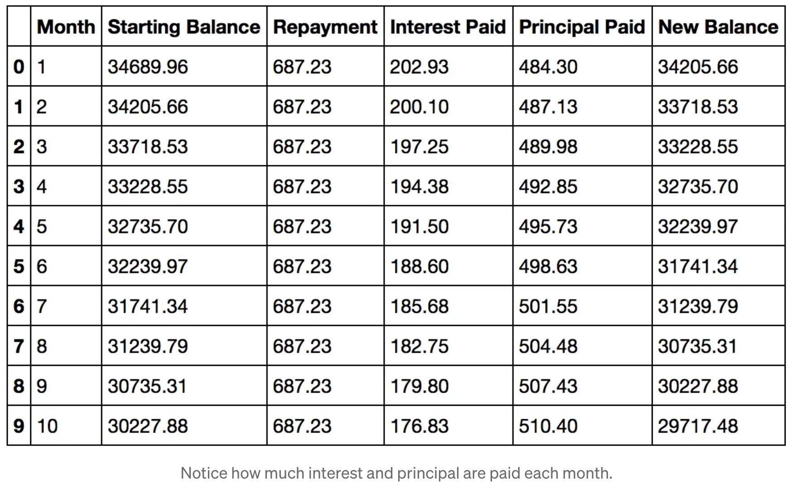

# Objectives
- Use Jupyter Notebooks
- Use the Pandas library to load data
- Identify and handle missing data

## Why use Pandas for Data Manipulation
This lesson will give you the tools to efficiently manipulate, analyze, and explore data using pandas. Pandas is a powerful Python library that makes it easy to work with structured data, such as CSV files, databases, and data scraped from the web. Whether you're cleaning data, performing aggregations, or analyzing trends, pandas provides a flexible and intuitive framework to streamline your workflow. The pandas table below shows how much interest and principal are paid each month on a 34689.96 dollar loan. 

## Jupyter Notebooks and Datasets

In order, the notebooks used are: 

- 01_IntroPandas.ipynb
- 02_Pandas.ipynb
- 03_Load_Data.ipynb
- 04_BasicOperations.ipynb
- 05_Slicing.ipynb
- 06_Filtering.ipynb
- 07_RenamingDeletingColumns.ipynb
- 08_AggregateFunctions.ipynb
- 09_IdentifyingMissingData.ipynb
- 10_RemoveFillMissingData.ipynb
- 11_ConvertNumPyArrayDict.ipynb
- 12_ExportCSVExcel.ipynb

In case you are curious about how the dataset used for these notebooks was created, here is a link to learn more: [The Cost of Financing a Car (Car Loans)](https://medium.com/towards-data-science/the-cost-of-financing-a-new-car-car-loans-c00997f1aee). This concept is applicable for mortgages as well (MortgagePayment.ipynb).

## Learn by Doing
- Compare car interest payments on 3,5,7, and 10% fixed rate loans. 
- Assuming you get an 6% fixed 30 year home loan, what is your payment (no fees)
- Assuming you get an 6% fixed 30 year home loan, how much interest do you pay over the course of a loan (you will have to do some research to figure this one out).
- (bonus hard question if you get bored) Assuming you got an 6% fixed 30 year home loan, and you refinance the loan 5 years into the loan at 5% fixed, what would be the difference in total interest payed between the loans. 
