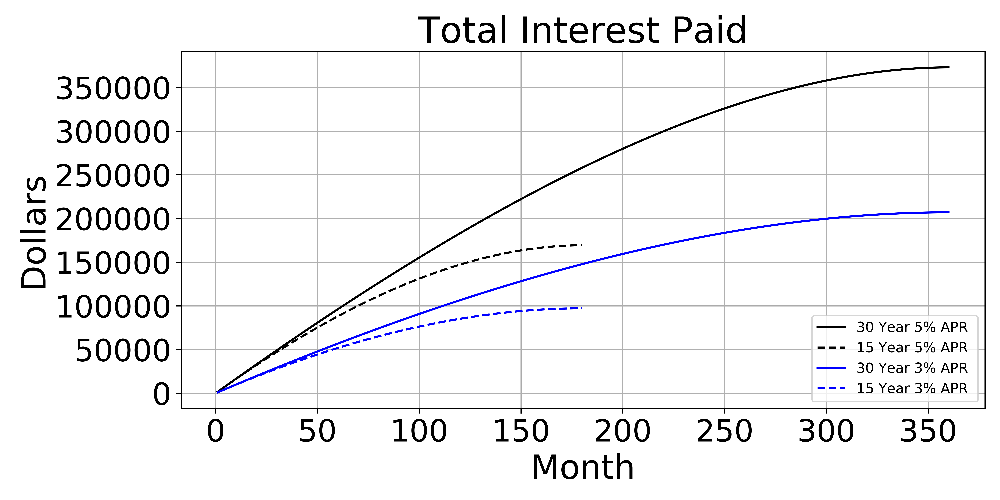

# Objectives
- Create and modify plots using the matplotlib, seaborn, and pandas Python libraries
- Identify the difference between MATLAB-style vs object oriented syntax for the Matplotlib library
- Save plots to files

## Why use Python for Data Visualization
This lesson will give you the tools to be able to visualize your data. Data visualization is not just important to be able to explore and understand your data, but also to understand how your machine learning algorithm is performing (e.g. confusion matrices, [loss curves](https://machinelearningmastery.com/plotting-the-training-and-validation-loss-curves-for-the-transformer-model/)). This lesson covers how to create plots using the matplotlib, seaborn, and pandas libraries. This includes confusion matrices, boxplots, and more.

## Jupyter Notebooks and Datasets

In order, the notebooks used are: 

- 01_BasicsMatplotlib.ipynb
- 02_MarkerTypeColor.ipynb
- 03_MATLABvsObjectSyntax.ipynb
- 04_TitlesLabelsLimits.ipynb
- 05_Grids.ipynb
- 06_Legends.ipynb
- 07_MatplotlibWrappersPandasSeaborn.ipynb
- 08_SavePlotsFile
- common_plot_applications/01_Heatmaps.ipynb
- common_plot_applications/02_Histograms.ipynb
- common_plot_applications/03_Subplots.ipynb

## Learn by Doing
- Create a visualization comparing car interest payments on 3,5,7, and 10% fixed rate loans.
- Create a visualization comparing home loan interest payments with 30 year term and 3,5,7, and 10% fixed rate loans.

## Content Inspired by the Sources

- [The Cost of Financing a Car](https://medium.com/towards-data-science/the-cost-of-financing-a-new-car-car-loans-c00997f1aee?source=friends_link&sk=6f006d48fb46dbd82e52db2ec3b12890) by Michael Galarnyk
