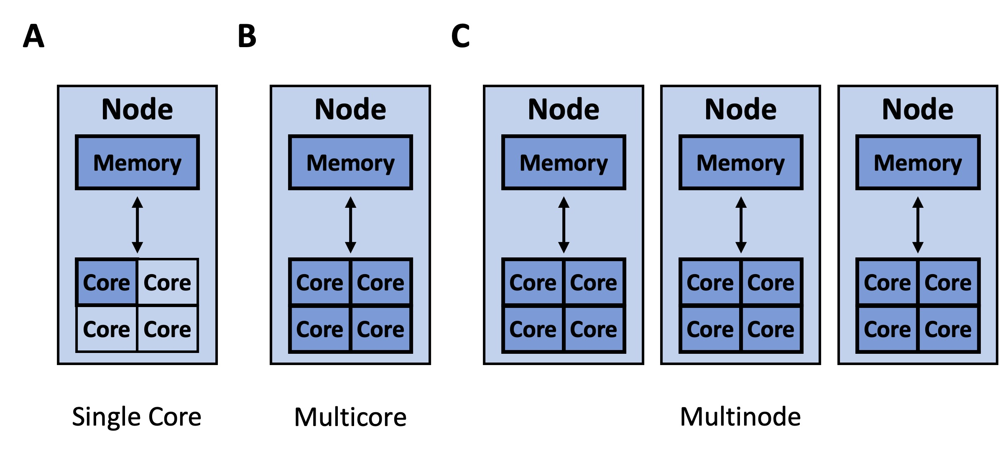
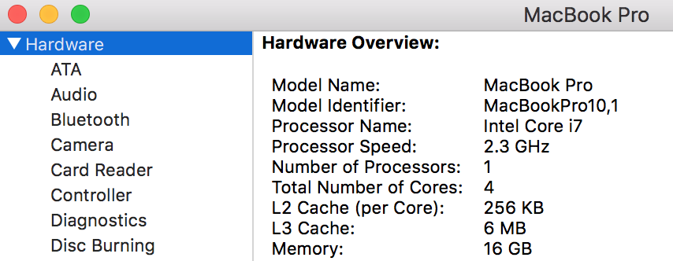

# Objectives
- Load, filter, and transform datasets using the Polars library  
- Perform efficient group-based operations and aggregations   
- Leverage parallelism for faster data processing  
- Export and save processed data to various file formats (CSV, Parquet, etc.)

## Why use Polars for Data Analysis

Polars is a high-performance DataFrame library designed for efficient data manipulation and analysis. Built in Rust, Polars offers seamless integration with Python, R, and Node.js, providing a versatile tool for data professionals. [Learn more](https://docs.pola.rs/).

### Key Features:

- Speed and Performance: Polars is engineered for speed, often outperforming other DataFrame libraries in various benchmarks. [See benchmarks](https://pola.rs/posts/benchmarks/).
- **Parallelism:** Polars automatically utilizes all available CPU cores, enhancing performance without additional configuration.

- **Lazy Evaluation:** Polars supports lazy evaluation, optimizing query execution by deferring computations until necessary. [Migration from pandas](https://docs.pola.rs/user-guide/migration/pandas/).
- **Out-of-Core Processing:** Polars can handle datasets larger than available memory through its streaming API, enabling efficient processing without loading all data into RAM. This is as opposed to [using more computational resources](https://github.com/gtfintechlab/CenterFinanceWorkshops/blob/main/NumPy_Pandas_Polars/03_Polars/images/more_compute.jpg). 

- **Interoperability:** Polars adheres to the Apache Arrow memory format, facilitating zero-copy data sharing with other tools and libraries.

## Jupyter Notebooks and Datasets

In order, the notebooks used are: 

- 01_BasicsPolars.ipynb

## Learn by Doing

Use the library in a use case you know of where you have insufficient RAM. 

Part of this talk is inspired from the following: 

- [Mastering Polars: High-Efficiency Data Analysis and Manipulation](https://www.geeksforgeeks.org/mastering-polars-high-efficiency-data-analysis-and-manipulation/#getting-started-with-polars-implementation) by geeksforgeeks
- [Python Polars: A Lightning-Fast DataFrame Library](https://realpython.com/polars-python/) by Harrison Hoffman

